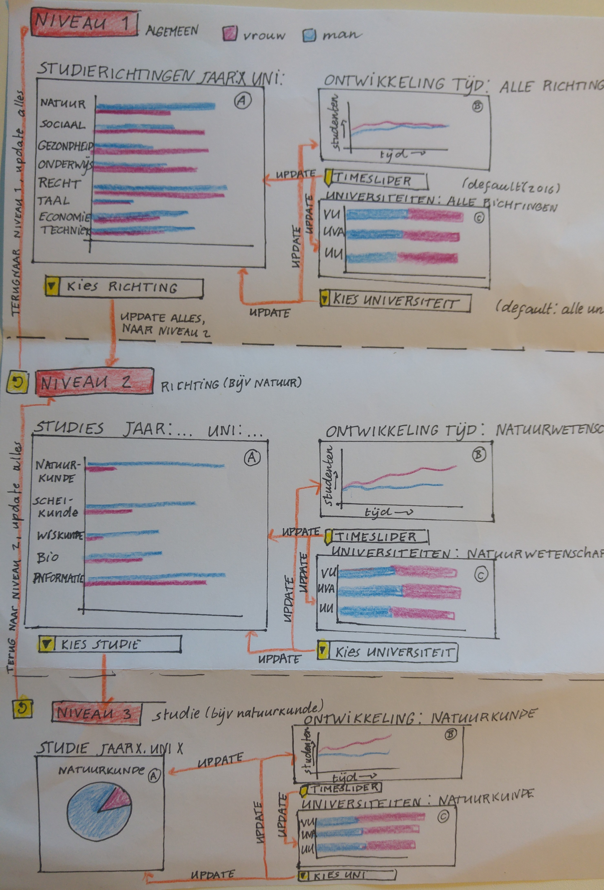

#Design document
Emma van Proosdij 10663657

#Gebruiker

Om het design van de visualisatie duidelijk te maken zal ik praten over "niveaus". Deze niveaus geven aan hoe diep je gespecialiseert bent in de data.
Op niveau 1 gelden de grafieken voor alle studies, terwijl in niveau 3 de grafieken binnen één specifieke studie gelden.

Hieronder is een schets van het design weergegeven met daaronder nog aanvullende uitleg. 

Op niveau 1 zie je een overzicht van het aantal jongens en meisjes binnen een studierichting d.m.v. een barplot. 
Daarnaast zie je het verloop in de tijd van het aantal jongens en meisjes binnen alle richtingen (x-as: tijd, y-as: totaal aantal studenten). 
Ook zie je een stacked bar chart van de man/vrouw verhoudingen binnen elke universiteit. Binnen dit scherm kun je een specifieke tijd of universiteit selecteren, daar zullen de andere 
studierichtingen zich op aanpassen.

Als je op een specifieke studierichting klikt ga je naar 'niveau 2'. Dat houdt in dat de grafieken nagenoeg hetzelfde zijn, maar de informatie op een
specifieker niveau wordt weergegeven. Als je bijvoorbeeld kiest voor de richting: natuurwetenschap krijg je nu een barchart te zien met de man/vrouw
verhouding binnen elke studie, terwijl dit in niveau 1 per richting was. De linechart van de tijd geld nu binnen de natuurwetenschap, net als de universiteiten.
Voor de rest zijn de niveaus nagenoeg gelijk.

Als je op een bepaalde studie klikt ga je naar "niveau 3". Daar wordt de bargraph vervangen door een pie chart van de precieze man/vrouw verhouding binnen
de gekozen studie. De linechart en barchart met universiteiten gelden nu binnen deze specifieke studie.

De verschillende niveaus worden niet tegelijk getoond, zoals het op de schets misschien een beetje lijkt. Als je klikt op een richting om naar het volgende niveau te gaan, wordt het vorige niveau vervangen.
Hieronder is nog een tabel die weergeeft welke informatie wordt getoond in elke grafiek.

| GRAFIEK A                    | GRAFIEK B                          | GRAFIEK C                       | NIVEAU  |  
|------------------------------|------------------------------------|---------------------------------|---------|
| onderscheid studierichtingen | ontwikkeling tijd: alle richtingen | universiteiten: alle richtingen |   1     |
| onderscheid studies          | ontwikkeling tijd: binnen richting | universiteiten: binnen richting |   2     |
| verdeling binnen studies     | ontwikkeling tijd: binnen studie   | universiteiten: binnen studie   |   3     |

#Data

De dataset die ik hiervoor ga gebruiken is 'ingeschreven-wo' van DUO. Deze dataset is weergegeven in een csv bestand. Omdat ik uit deze dataset dingen moet optellen,
en ook catogorien moet maken die in de csv onder elkaar staan (bijvoorbeeld gesorteerd op universiteit), zal ik de data weergeven in een json bestand.
De opzet van deze json wordt als volgt:

Data

----- sectoren

--------- studie

-------------- jaar

------------------- universiteit

------------------------- man: ..., vrouw: ...,

Bij de catogorien sectoren, studie, en universiteit is een van de kopjes: algemeen. Dit geef de totale hoeveelheid aan in plaats van binnen 
één specifieke studie.

#Grafieken

Voor deze visualisatie moeten vier verschillene soorten grafieken worden geimplementeerd, een (normale) barchart
een stacked barchart, een linechart en een piechart. Van al deze grafieken staan diverse voorbeelden online en
heb ik ook zelf al een keer gemaakt, m.u.v. de stacked bar chart. 
Ik denk dat de technische implementatie van deze grafieken niet extreem ingewikkeld is, maar dat de uitdaging is om de zorgen dat de goede data in de 
goede grafiek terecht komt, en hoe je dat allemaal gaat schalen.

