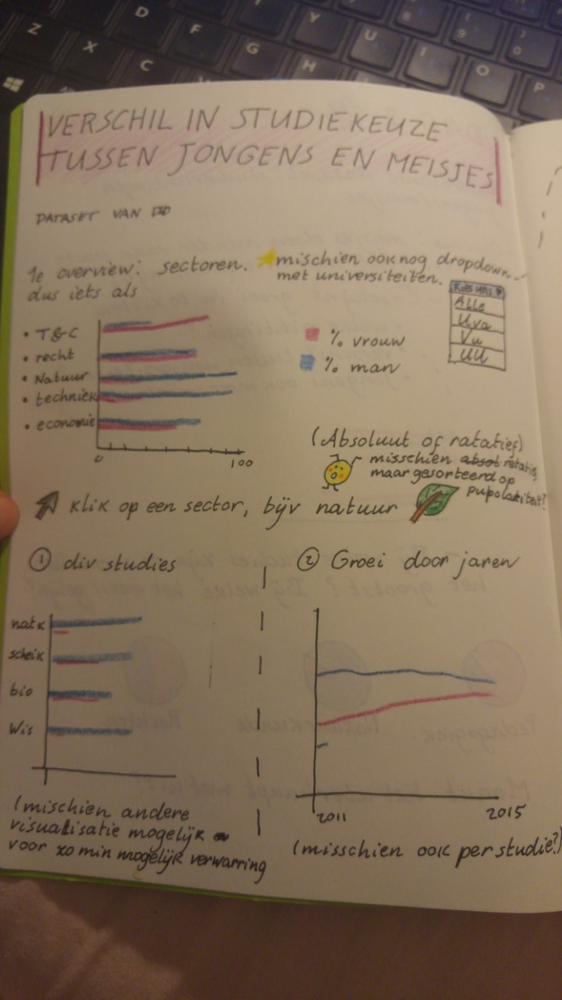
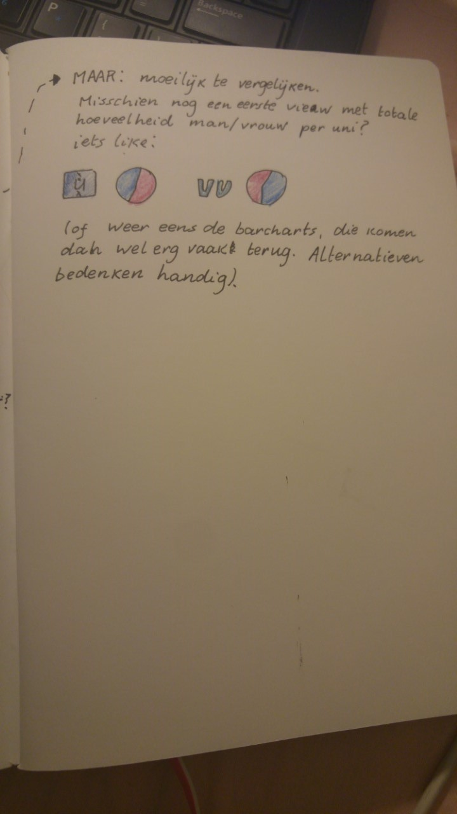

# De verschillen in studiekeuze tussen jongens en meisjes
Emma van Proosdij - 10663657

Het is algemeen bekend dat jongens vaak voor andere studies kiezen dan meisjes. Jongens kiezen vaker voor natuur of technische studies, terwijl meisjes meer sociale studies kiezen. In dit project wil ik hier uitgebreider op ingaan. Zijn er bij elke technische studie weinig meisjes of zijn er alleen een paar extremen die de boel onderuit halen? In welke vakgebieden zijn de grootste verschillen, en in welke zijn juist net zoveel jongens als meisjes? Ook wil ik bekijken hoe dit zich ontwikkeld in de loop van de tijd. In nieuwsberichten verschijnt vaak dat er steeds meer meisjes voor technische studies kiezen. Met mijn visualisatie wil ik inzichtelijk maken hoeveel meer voor welke studies precies.

Hiervoor zal ik gebruik maken van een dataset van DUO waarin precies staat aangegeven hoeveel jongens en hoeveel meisjes er voor elke opleiding zijn ingeschreven, bij welke universiteit deze opleidingen horen en binnen welke sector ze passen. De dataset ziet er aardig overzichtelijk en compleet uit, dus ik vermoed dat ik niet extreem veel tijd hoef te besteden aan het prepareren van de data.

Hier volgt mijn voorlopige opzet, onder de plaatjes ook in tekst uitgelegd.

- Als eerste een overview van het aantal jongens en meisjes binnen elke sector dmv een barchart. In dit scherm is een dropdown menu aanwezig waarin je een universiteit kan selecteren of het totaal. Ook is er een timeslider waardoor je kunt zien hoe dit is veranderd in de afgelopen jaren.
- Als je klikt op één van de sectoren, zie je opnieuw een barchart maar dit keer met de specifieke studies waar voor gekozen is. Zo kun je zien of een verschil tussen jongens en meisjes overal geld binnen een sector of alleen bij een paar specifieke studies. Ook zie je een scherm met een linechart met de stijging en daling van het aantal jongens en meisjes over de afgelopen jaren. 
- Als je op een studie klikt kun je weer een linechart zien met de stijging en daling van het aantal jongens en meisjes voor deze specifieke studie. Als je in het begin hebt gekozen voor alle universiteiten kun je hier ook nog het verschil tussen de verschillende universiteiten zien.

Een paar dingen waar ik nog niet over uit ben:
- In deze opzet maak ik erg veel gebruik van barcharts die best wel op elkaar lijken. Misschien kan dat verwarrend worden? Het lijkt met verstandig om nog na te denken over alternatieve visualisaties.
- Of ik met absolute of relatie cijfers moet werken in de barcharts. Bij relatieve cijfers is beter het verschil tussen jongens en meisjes te zien, maar misschien geeft het een vertekend beeld als er voor een hele kleine studie en heel scheve man/vrouw ratio en dat dat er dan hetzelfde uitziet als een hele grote studie. 
- Het lijkt me ook interessant om een paar voorbeelden te laten zien van studie waar de ratio's heel extreem zijn, of waar ze juist nagenoeg gelijk zijn, maar ik weet nog niet helemaal hoe dit in het grotere plaatje pas. 

